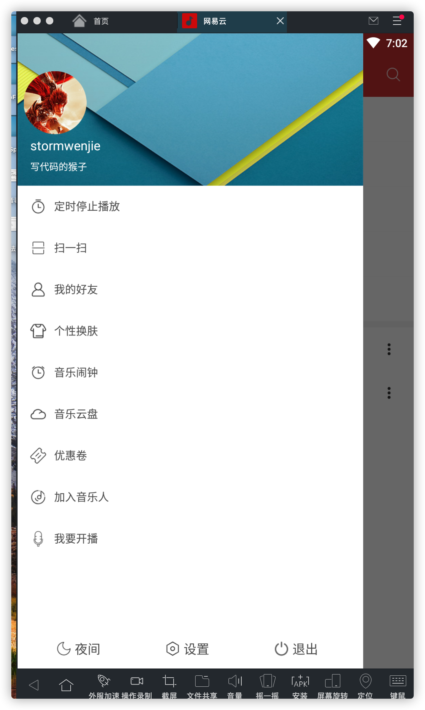

# CocoMusic
感觉学习了很多知识但是工作中主要涉及到的是业务代码，所以一直没有抽空来好好做一个涉及知识点比较全面的音乐软件。为了未来更好的自己，just do it

1.外观模仿较早版本的网易云，还有很多不完善的地方，但是很多东西的实现和思路值得学习和借鉴。互相进步

1.功能截图如下

2.实现的功能有底部控制栏左右滑动切换歌曲；
2.1 通知栏点击切换歌曲，播放暂停，自定义底部控制栏
2.2 本地音乐文件的读取展示以及按照歌手维度统计等。（该部分功能用的数据库，不过好像统计有些问题，暂时可能没空看了）

基本的播放功能和展示功能问题不大，小伙伴们可以自己下载下来后在基础上进行修改和调整，增加功能

开发 ide 是 AndroidStudio，运行模拟器是 网易momo。代码本身还有一些问题，比如说对高版本的适配可能有些问题，导致读取文件失败。
本地音乐播放通知基本都完成。在线播放应该也可以直接用，因为目前早已转做前端，所以很多功能就看之后时间是否实现吧。有问题欢迎与我交流。

